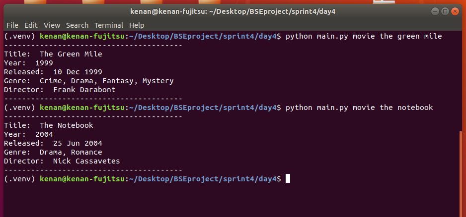
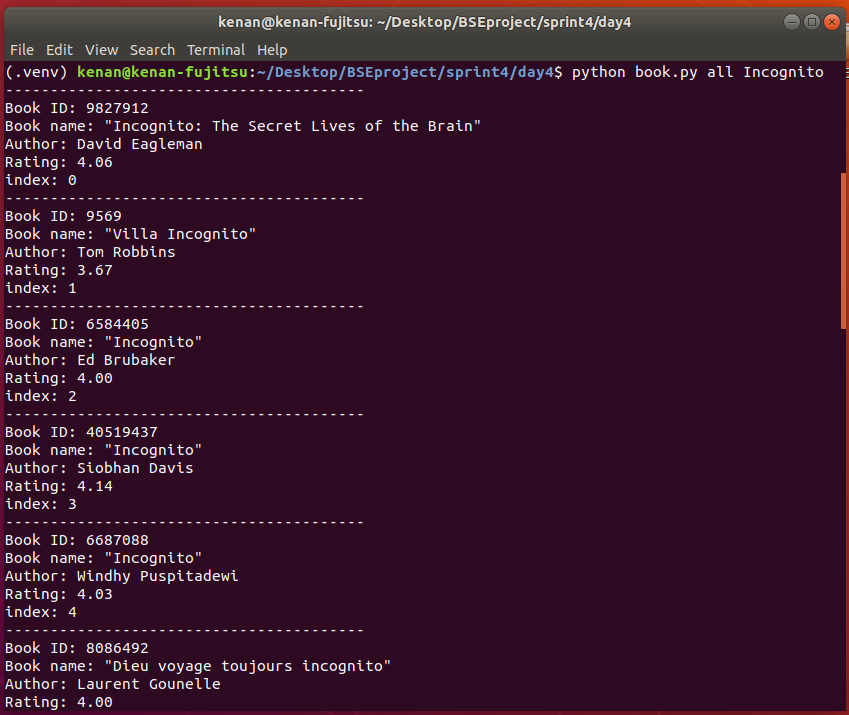
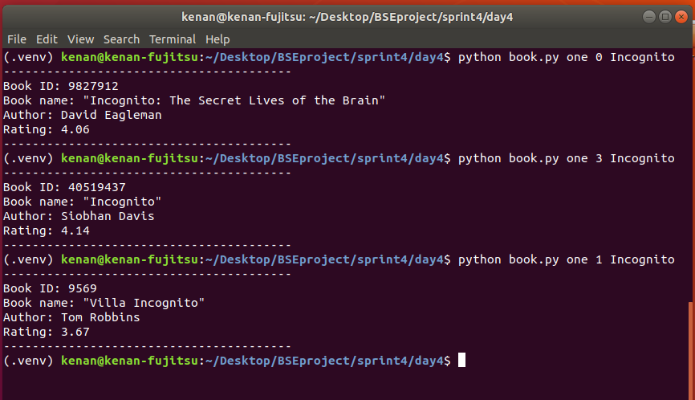

## Console App about Books

### 4.day tasks

* Create a virtual environment
* Install Requests pip package
* Freeze pip packages to requirements.txt file
* Write an application that works with the OMDB api.
* When the user enters the command movie movie_name (python main.py movie the green mile), information about the movie should appear on the screen.
* If no movie is found, the application must notify the user that the movie has not been found.

### Console pictures

### Extra tasks

* Write an application that works with the GoodReads api.
* When the user enters the command all book_name (python main.py all incognito), the list of informations about the book should appear on the screen.
* When the user enters the command one specific_index book_name (python main.py one 0 incognito), information about the book should appear on the screen.

### Console pictures

